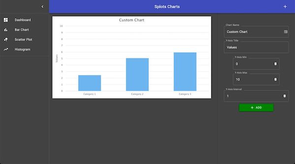

# Charts Application (Demo)
### Work in progress... not ready for production use.

This application is being made as a virtual student assessment tool for teachers to test their students on modeling data to various chart types.

## Live link: [Chart App](https://chart-app.brodiebarton.com/)

### `npm start`

Runs the app in the development mode. 
Open [http://localhost:3000](http://localhost:3000) to view it in the browser.
